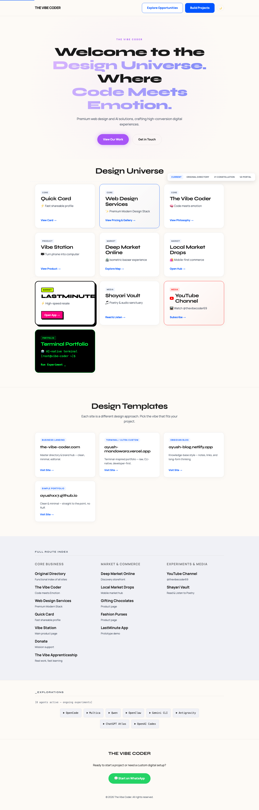
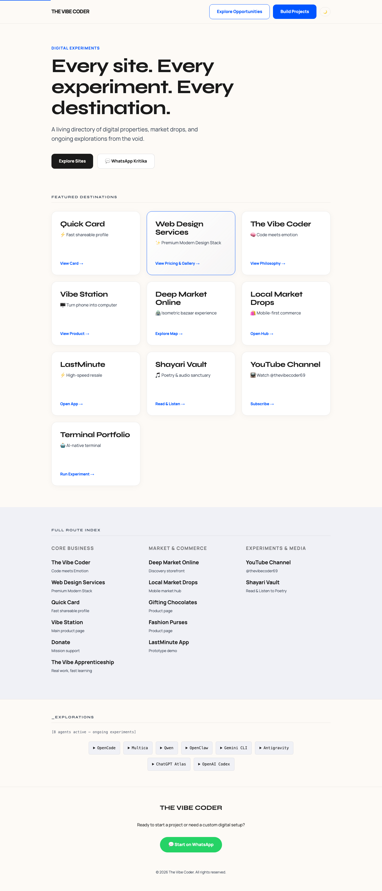
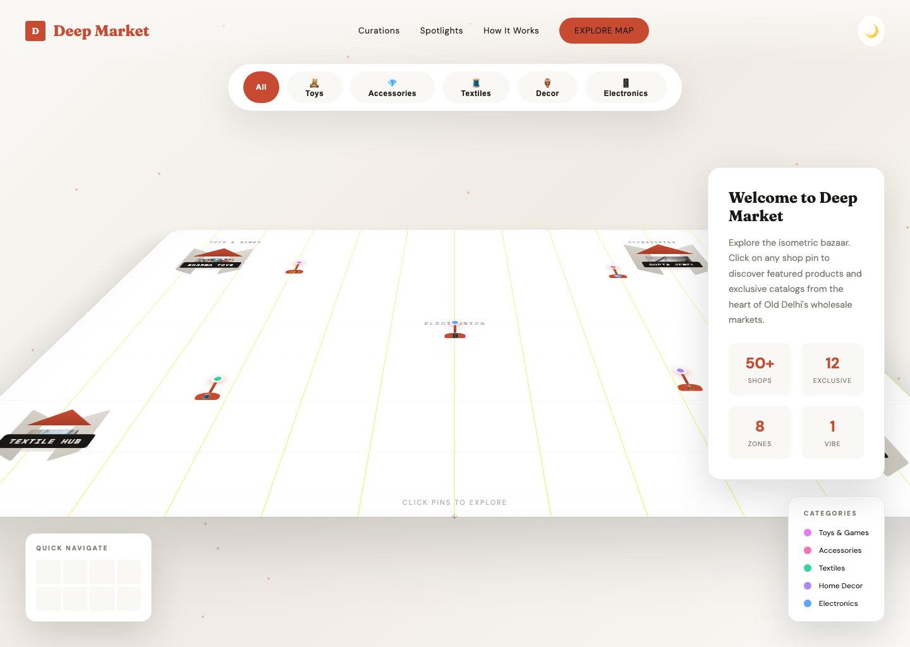
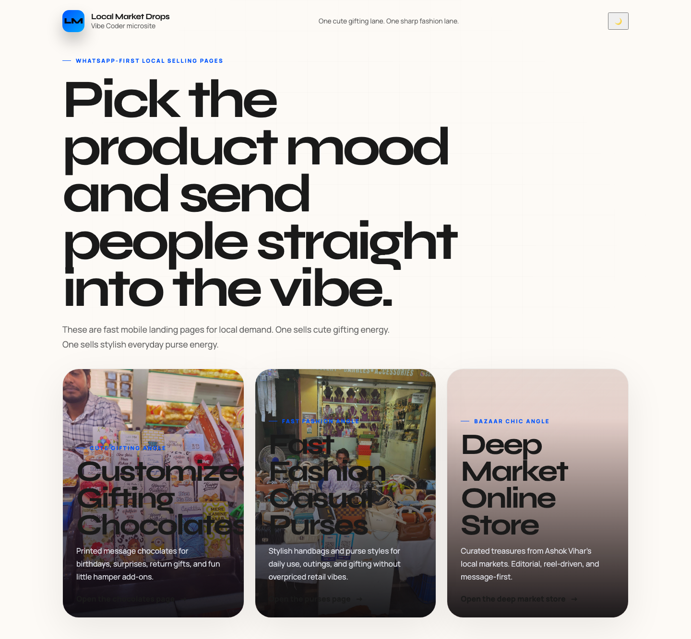
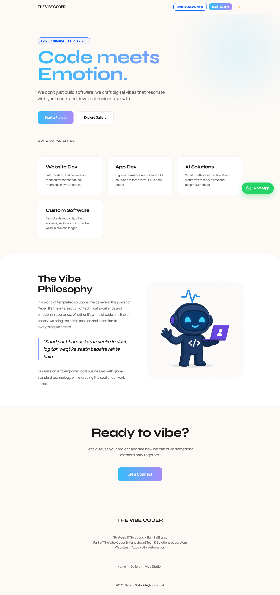
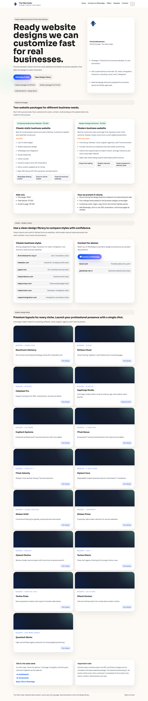

# [✨ The Vibe Coder ✨](https://the-vibe-coder-69.github.io/www/)

[](https://the-vibe-coder-69.github.io/www/)

The Vibe Coder is a design and automation ecosystem focused on transforming digital interactions into meaningful conversations. We blend high-end aesthetics with smart AI-driven automation to help businesses grow authentically.

---

## 🌌 The Design Universe

A curated collection of web experiments, service portals, and interactive experiences.

| 🏠 Home Hub | 📚 Master Directory |
| :---: | :---: |
|  |  |

---

## 🏪 E-Commerce & Market Experiments

Explorations in digital storefronts, isometric bazaars, and localized "drops".

| 🏙️ Deep Market Online | 🛍️ Local Market Drops |
| :---: | :---: |
|  |  |

### 🔍 Deep Dive: Market Ecosystem
- **Deep Market**: An isometric bazaar experience for exploring products in a spatial context.
- **Local Drops**: Targeted, high-conversion landing pages for specific product categories like chocolates and fashion.

| 🍫 Gifting Chocolates | 👜 Fashion Purses |
| :---: | :---: |
|  |  |

---

## 🛠️ Service Portals

Professional tools and pricing structures for the modern digital agency.

| 💻 Vibe Station | 💰 Web Design Pricing |
| :---: | :---: |
|  |  |

- **Vibe Station**: Our flagship hardware-to-software solution that transforms smartphones into full-fledged workstations.
- **Transparent Pricing**: Ready-to-use design packages for businesses that need to move fast.

---

## 🤖 Tech Stack & Quality

Built with a focus on performance, persistence, and verified quality.

### 🛠️ Core Technologies


### ✅ Verified Quality
- **Automated QA**: Full visual regression suite using Playwright.
- **Vision Reviews**: AI-powered UI audits to ensure pixel perfection.
- **Responsive**: Tested across Desktop and Mobile viewports.

---

## 🚀 Quick Start

1. **Clone & Install**:
   ```bash
   git clone https://github.com/the-vibe-coder-69/www.git
   cd www
   npm install
   ```

2. **Run Dev Server**:
   ```bash
   npm start
   ```

3. **Run Visual Tests**:
   ```bash
   npm run qa:update-screens
   ```

---

## 📮 Contact & Community

Ready to vibe? Let's build something meaningful.

[**WhatsApp Us**](https://wa.me/916395906067) | [**Explore Directory**](https://the-vibe-coder-69.github.io/www/index-directory.html)
